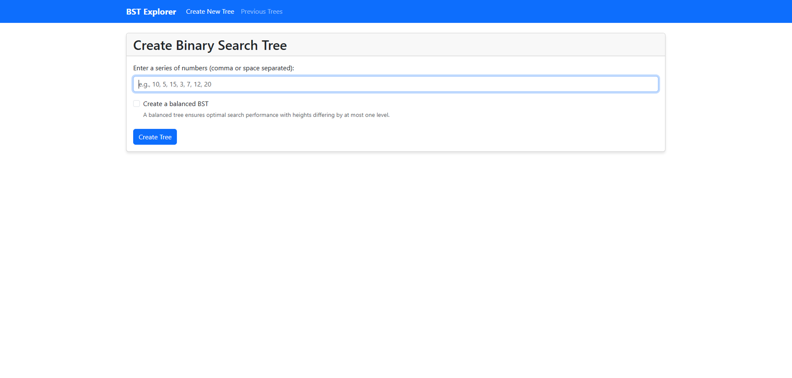
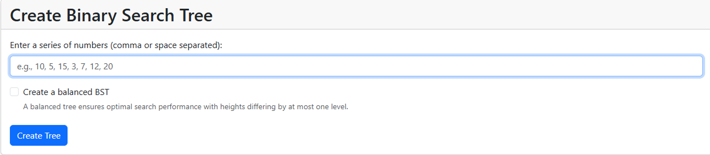
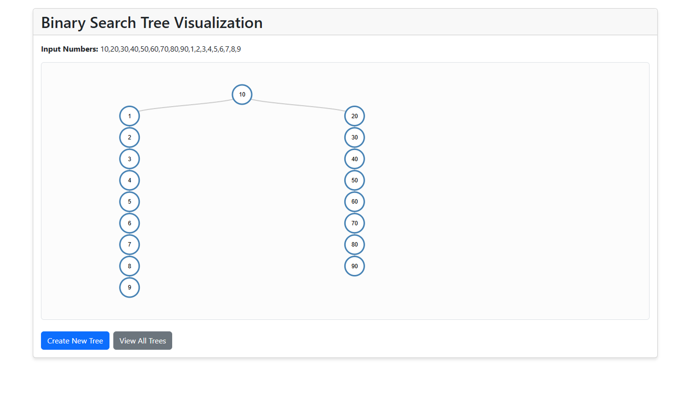
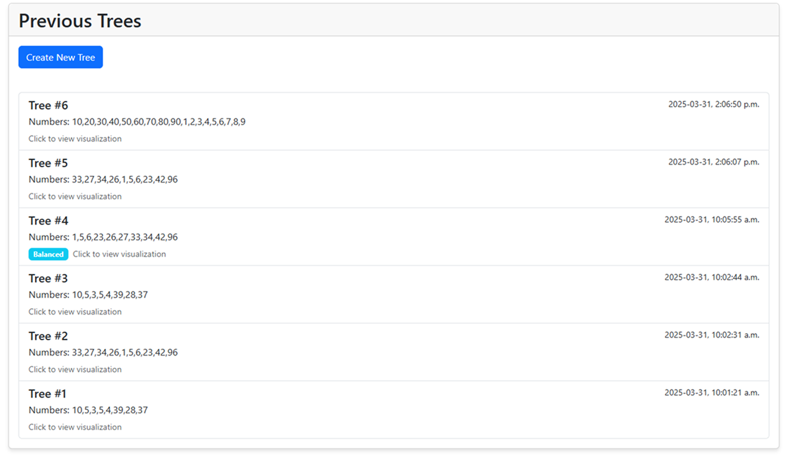

# BST Explorer

A full-stack application for visualizing and exploring Binary Search Trees (BSTs).



## Overview

BST Explorer allows users to create, visualize, and explore Binary Search Trees. Users can input a series of numbers, and the application constructs a tree visualization, showing how the numbers are organized in a BST structure. The application also supports balanced trees and maintains a history of previously created trees.

## Features

- **Binary Search Tree Creation**: Create BSTs from user-provided numbers
- **Tree Visualization**: Interactive visualization of tree structures using D3.js
- **Balanced Tree Option**: Option to create balanced BSTs for optimal performance
- **History Tracking**: View and revisit previously created trees
- **RESTful API**: Well-designed API for tree operations

## Technology Stack

### Backend

- **Java Spring Boot**: For the server-side application
- **Spring Data JPA**: For database operations
- **H2 Database**: For data storage
- **JUnit**: For unit testing

### Frontend

- **React**: For building the user interface
- **React Router**: For client-side routing
- **D3.js**: For tree visualization
- **Axios**: For API communication
- **Bootstrap**: For responsive design

## Getting Started

### Prerequisites

- Java JDK 11 or higher
- Node.js 14+ and npm
- Maven

### Running the Backend

1. Clone the repository
2. Navigate to the backend directory
   ```bash
   cd bst-explorer
   ```
3. Build the project
   ```bash
   mvn clean install
   ```
4. Run the application
   ```bash
   mvn spring-boot:run
   ```
   The backend will start on http://localhost:8080

### Running the Frontend

1. Navigate to the frontend directory
   ```bash
   cd bst-explorer-client
   ```
2. Install dependencies
   ```bash
   npm install
   ```
3. Start the development server
   ```bash
   npm start
   ```
   The frontend will start on http://localhost:3000

## API Endpoints

| Method | Endpoint        | Description              |
| ------ | --------------- | ------------------------ |
| POST   | /api/trees      | Create a new BST         |
| GET    | /api/trees/{id} | Retrieve a specific tree |
| GET    | /api/trees      | List all trees           |

## Binary Search Tree Concepts

### Regular BST

A binary search tree is a tree data structure where each node has at most two children, and all nodes follow the property that nodes in the left subtree have values less than the node's value, and nodes in the right subtree have values greater than the node's value.

### Balanced BST

A balanced BST ensures that the height difference between the left and right subtrees of every node is no more than one. This balancing ensures optimal O(log n) performance for search, insert, and delete operations.

## Screenshots

### Create Tree Page



### Tree Visualization



### Previous Trees




## License

This project is licensed under the MIT License - see the LICENSE file for details.

## Acknowledgments

- Data Structures and Algorithms course
- D3.js community for visualization examples
- Spring Boot and React documentation
